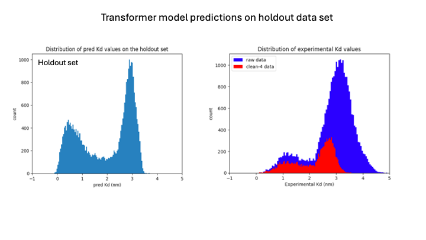
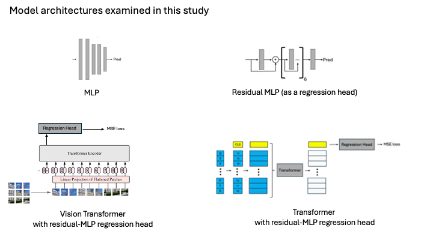

#  A study in using BERT to calculater antibody-antigen binding  May 2024

## Overview:
- This study outlines creating and training regression models to predict binding affinites from sequence data for single-chain variable regions of human immunoglobulins.
- Please refer to the PowerPoint slide deck for a complete overall description of all work (`Homework-aAlphaBio.pptx`) 

----
### The Inference file that I have submitted for grading can be found here
`./inference_results/tform_mlp_model/cleaned-4-data/preds_tform_mlp_1715104590.5575511.csv`

----
## Model architectures

  

- 4-layer MLP
- Vision Transformer: trained on 1-channel and 3-channel, with a  
- Transformer with 4-layer residual-MLP regression head

----
## Project Structure

| folder / file  | Contents  |
|:----------|:----------|
| ./config               | configuration files for the models    |
| ./data                 | raw and processed data    |
| ./datasets             | dataset classes    |
| ./images               | images for the README file |
| ./inference_results    | results of running inference on holdout set    |
| ./lightning_logs       | all training logs and checkpoints    |
| ./misc_analysis        | misc files generated in t-SNE and related..    |
| ./models               | model classes    |
| ./test_results         | results of all test runs    |
| ./train_test_inference | scripts for train, test, and inference of the models    |
| ./Analysis.ipynb       | notebook for misc. analysis and t-SNE plots   |
| ./DataAnalysis.ipynb   | notebook used to create training sets from raw daya    |
| ./Homework-aAlphaBio.pptx | PowerPoint slide deck for this study |
| ./README.md | this file |

----
## How to run training, test, and inference jobs

Just to verify some of this code, you should be able to run this commands from the command line with no changes
- first cd to the ./train_test_inference folder
- `python test_mlp.py`   (the mlp_params.yaml file already points to the proper checkpoint and is set up to run on the cpu)

### Overall architecture of running commands
- Train and test scripts exist for each individual model (in ./train_test_inference/ folder) 
- You run these from the command line inside this folder
- All paths in the config files (./config) are relative to this folder
- A single inference script (inference_tform_mlp.py) is also in this folder
    - I made only a single inference script for the Transformer model since it was used for final predictions
- A command will run, drawing on code from the ./datasets and ./models folders.  Output files will be written to the locations specified in the config files

### Files produced
- training 
    - log files, checkpoint files, etc are saved in the log_dir specified in the config file
- testing
    - metrics_xxx.txt : a text file of all the error analysis done
    - preds_xxx.pkl : pickle file of predictions
    - y_xxx.pkl : pickle file of ground truth values
- inference
    - produces one file: preds_tform_mlp_xxx.csv with two columns: the sequence id and predicted Kd value

----
## Config files

The config files are divided into 4 main sections.  The contents should be largely self-explanatory
- model_params
- train_params
- test_params
- inference_params

#### Some caveats however

- All paths are relative to the train-test-inference folder
- You may need to change `accelerator` and `devices` to suite your environment
- `checkpoint_name`  Typically this is given as `None`
    - 	training_params: checkpoint_name is given a specific value, the training job will restart from this checkpoint
    -   test_params: indicates which checkpoint to use for test run
    -   inference_params: indicates which checkpoint to use for inference run
- All outputs from test and inference calcs are deposited in the stated folder(s) in their respective sections
- The files are never overwritten, but are tagged with a trailing timestamp given as milliseconds since epoch

----

## Pre-trained weights files locations

| Model  | Dataset  | Weights file |
|:----------|:----------|:----------|
| MLP    | clean-3b            | lightning_logs/mlp_model/cleaned-3b-data/trained/checkpoints    |
| VIT 1-channel   | clean-3b   | lightning_logs/vit_model/cleaned-3b-data/1-channel/trained/checkpoints    |
| VIT 3-channel  | clean-3b    | lightning_logs/vit_model/cleaned-3b-data/3-channel/trained/checkpoints    |
| Transformer    | clean-1     | lightning_logs/tform_mlp_model/cleaned-1-data/trained/checkpoints    |
| Transformer    | clean-3b    | lightning_logs/tform_mlp_model/cleaned-3b-data/trained/checkpoints    |
| Transformer    | clean-4     | lightning_logs/tform_mlp_model/cleaned-4-data/trained/checkpoints   |

